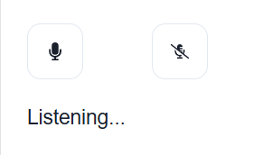

## Overview

The Sppech-To-Text component using the SpeechRecognition webkit,enables users to convert recorded speech into text, displaying the recognized speech in real-time.

### Speech to text component




### Properties:

| Name        | Type             | Required | Description                                                               |
| ----------- | ---------------- | -------- | ------------------------------------------------------------------------- |
| Language | string | No      | Will contain the selected navigator language to which the audio will be recorded (by default it's english) |

### Qodly source

| Name        | Type             | Required | Description                                                               |
| ----------- | ---------------- | -------- | ------------------------------------------------------------------------- |
| Qodlysource | string | Yes      | Will contain the converted text from the recognized speech |

### Custom css

```css
/* to customize the style of the whole container */
self .speech-to-text{
	
}

/* to customize the style of the button */
self .toggle-button{
	
}

/* to customize the style of the text */
self .transcript-content{
	
}
```
